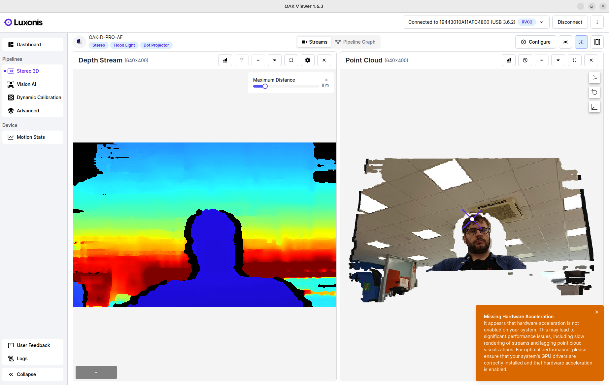
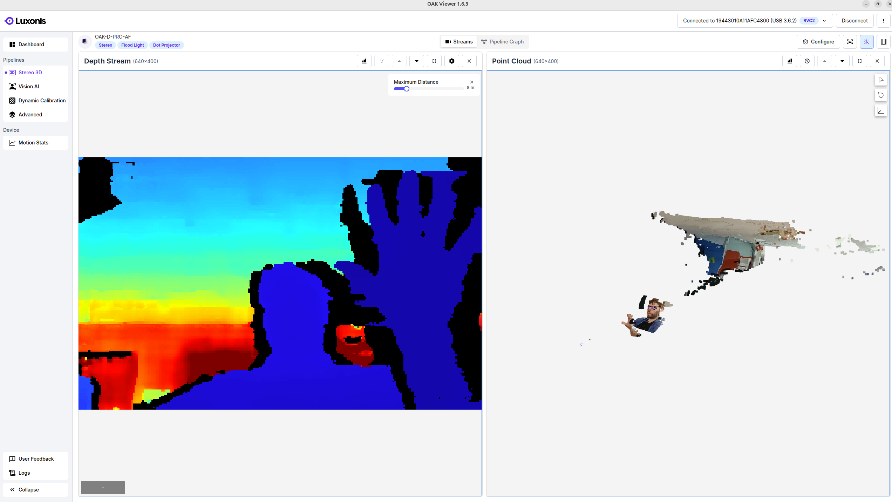
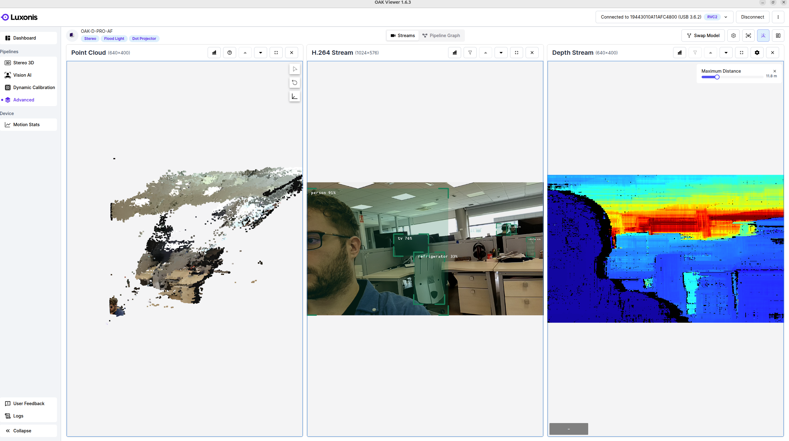
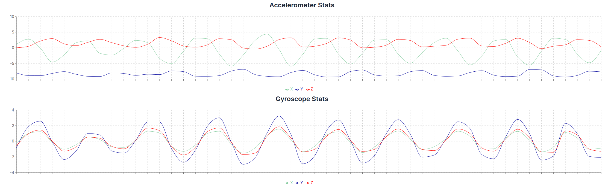

# depthaiv3

**DepthAI** es el software oficial y principal para manejar las cámaras OAK (OpenCV AI Kit), tanto uso básico, como profundidad, funcionalidades IA, visualizador (**OAK Viewer**), linea de comandos (**oakctl**), VSLAM, etc.

Esta es la API de DpethAI v3 oficial, para cámaras OAK y OAK4 (instalación, ejemplos y referencia Python/C++). No es necesario manipular ningún puerto USB; el uso de las cámaras es inmediato.

Ver https://docs.luxonis.com/software-v3/depthai/.

Instalación:

```bash
git clone https://github.com/luxonis/depthai-core.git && cd depthai-core
python3 -m venv venv
source venv/bin/activate
# Installs library and requirements
python3 examples/python/install_requirements.py
# o por pip:
#pip install depthai --force-reinstall
```

Ejemplos:

```bash
cd examples/python
# Run YoloV6 detection example
python3 DetectionNetwork/detection_network.py
# Display all camera streams
python3 Camera/camera_all.py
```

## OAK Viewer

Es una aplicación de escritorio para probar las cámaras rápidamente. Ver https://docs.luxonis.com/software-v3/depthai/tools/oak-viewer/.









_(en el cuarto ejemplo, estaba tambaleando la cámara)_

Cabe decir que nos puede avisar de que la aceleración por hardware (VA-API/GPU) no está activa; el enfoque principal es asegurar que los controladores gráficos estén actualizados y forzar la aceleración.:

```bash
# Comprobar el estado actual. Si se recibe un error (como "Failed to open VDPAU backend"), la aceleración no está activa.
vainfo

# Identificar la tarjeta gráfica (GPU) y controlador activo
lspci -k | grep -EA3 'VGA|3D|Display'
lshw -c video

# Instalar los controladores necesarios. Dependiendo del hardware, instalar los paquetes de VA-API (Video Acceleration API):
#   Intel: sudo apt install intel-media-va-driver (para gráficas modernas) o libva-intel-driver
#   AMD: sudo apt install mesa-va-drivers
#   NVIDIA:
#       Opción A (Recomendada/Nouveau): sudo apt install mesa-va-drivers
#       Opción B (Drivers Propietarios): sudo apt install libva-nvidia-driver
