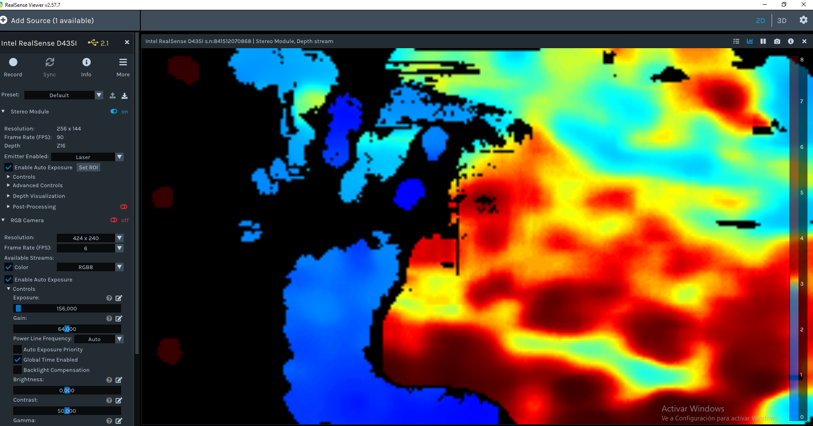

# RealSense D435i — playground mínimo

La **Intel RealSense D435i** es una cámara **RGB-D** (par estéreo + color) con **IMU** integrada (acelerómetro y giroscopio). Sirve para SLAM, odometría visual-inercial, reconstrucción densa, etc.

Este directorio contiene un visor mínimo: **profundidad alineada al color** + imagen RGB en vivo con `matplotlib`, y opción de leer **IMU** en consola.

La Intel RealSense D435i no ha sido descatalogada y sigue en producción. Aunque Intel ha descontinuado sus líneas de LiDAR (L515) y de seguimiento (T265), se está centrando en la serie de cámaras estéreo D400, incluida la D435i.

> Problema: USB 3.x
> La D435i puede funcionar cuando se conecta a un puerto USB 2.1 (o 2.0), pero malamente, pues funcionará con un rendimiento reducido, limitando las resoluciones y tasas de fotogramas disponibles (al mínimo de resolución y FPS). Se recomienda usar solo puertos USB 3.x o a través de un Hub activo al puerto USB-C.

Una captura del viewer de Windows:



## Dependencias

Se puede reutilizar el mismo entorno virtual que en `../realsense_t265` (mismos paquetes):

```bash
# Si ya tienes el venv de t265:
source ../realsense_t265/.venv/bin/activate

# O instalar aquí:
pip install -r requirements.txt
```

Paquetes: `pyrealsense2`, `matplotlib`, `numpy`.

En WSL con ventanas gráficas suele hacer falta:

```bash
sudo apt install -y python3-tk
```

## Uso

```bash
python d435i_depth_color_viewer.py
```

Forzar backend Tk (WSL + GUI):

```bash
python d435i_depth_color_viewer.py --force-tk
```

Solo terminal (sin ventana):

```bash
python d435i_depth_color_viewer.py --no-gui
```

Incluir streams IMU (acelerómetro + giroscopio) y mostrar valores en la línea de estado:

```bash
python d435i_depth_color_viewer.py --imu
```

Listar dispositivos (solo carga `pyrealsense2`, no hace falta matplotlib):

```bash
python d435i_depth_color_viewer.py --list-devices
```

Resolución / FPS (si el perfil no es válido, el SDK lanzará error; probar p. ej. 640×480 o 1280×720):

```bash
python d435i_depth_color_viewer.py --width 1280 --height 720 --fps 15
```

Salir: `Ctrl+C`.

## WSL y USB

Si `lsusb` ve la cámara pero `--list-devices` en Python no (típico en WSL tras `usbipd attach` por permisos), sigue la guía única:

[WSL + usbipd troubleshooting (permisos / BUSID / nodos `/dev/bus/usb/BBB/DDD`)](../realsense_t265/README_wsl_usbipd.md#wsl-usb-permissions)

Documentación oficial (Python / ejemplos): [Intel RealSense — Python](https://dev.intelrealsense.com/docs/python2).
