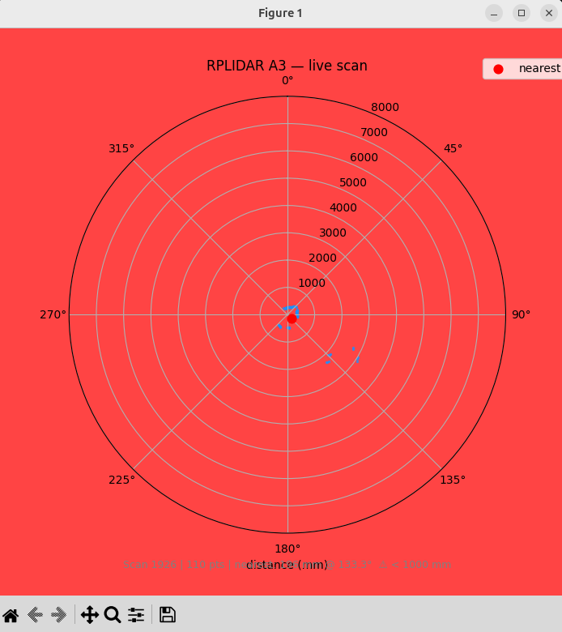

# RPLIDAR A3 (M1R1) — playground mínimo



El **RPLIDAR A3** es un escáner láser 2D de 360° de Slamtec. Gira a velocidad controlable y mide distancias por triangulación láser, generando una nube de puntos 2D a 16.000 muestras/segundo.

Este directorio contiene un escáner mínimo: **polar plot en tiempo real** con matplotlib y modo terminal con estadísticas por barrido.

---

## Ficha técnica

| Campo | Valor |
|-------|-------|
| Tipo | LiDAR 2D rotatorio (triangulación láser) |
| Rango de distancia | 0.2 m – 25 m |
| Ángulo de barrido | 360° |
| Frecuencia de barrido | 5 – 20 Hz (ajustable por PWM del motor) |
| Muestras por segundo | hasta 16.000 |
| Resolución angular | ≈ 0.225° típico a 10 Hz |
| Conexión | USB (CP2102 USB-to-UART) |
| Baud rate | **256.000** (≠ A1/A2 que usan 115.200) |
| SDK Python | `rplidar-roboticia` |
| Modelo | A3 M1R1 (1ª revisión hardware de la serie A3) |

---

## Dependencias

```bash
python3 -m venv .venv
source .venv/bin/activate
pip install -r requirements.txt
```

Paquetes: `rplidar-roboticia`, `matplotlib`, `numpy`.

En WSL con ventanas gráficas suele hacer falta:

```bash
sudo apt install -y python3-tk
```

---

## Permisos USB (Linux)

El adaptador USB-serie del RPLIDAR aparece como `/dev/ttyUSB0`. Para acceder sin `sudo`:

```bash
sudo usermod -aG dialout $USER
# Cerrar sesión y volver a entrar para que surta efecto
```

O de forma temporal (sin re-login):

```bash
sudo chmod 666 /dev/ttyUSB0
```

En WSL es necesario pasar el dispositivo USB al subsistema Linux con `usbipd`:

```powershell
# PowerShell (Windows, como administrador)
usbipd list                        # localizar BUSID del CP2102
usbipd bind --busid <BUSID>
usbipd attach --wsl --busid <BUSID>
```

---

## Uso

### Listar puertos serie disponibles

```bash
python rplidar_a3_scan.py --list-ports
```

### Visor polar en tiempo real (GUI)

```bash
python rplidar_a3_scan.py
```

Puerto distinto al predeterminado:

```bash
python rplidar_a3_scan.py --port /dev/ttyUSB1
```

Ajustar la distancia máxima visualizada (en mm, por defecto 8000):

```bash
python rplidar_a3_scan.py --max-dist 5000
```

Forzar backend Tk (WSL + GUI):

```bash
python rplidar_a3_scan.py --force-tk
```

### Solo terminal (sin ventana)

```bash
python rplidar_a3_scan.py --no-gui
```

Salida por barrido:

```
Scan    1 | points= 587 | min=   312 mm  avg=  3241 mm  max=  7998 mm | nearest → 312 mm @ 47.3°
Scan    2 | points= 591 | min=   309 mm  avg=  3238 mm  max=  7995 mm | nearest → 309 mm @ 47.1°
```

### Parar tras N barridos completos

```bash
python rplidar_a3_scan.py --n-scans 10
```

---

## Notas de uso

- **Baud rate A3 = 256.000.** Si usas un A1 o A2, pasa `--baudrate 115200`.
- El lidar necesita ~2 s para estabilizar la velocidad de giro antes de que los datos sean fiables.
- Si el sensor devuelve estado `Error`, el script intenta un reset automático (`lidar.reset()`). Si persiste, desconecta y vuelve a conectar el USB.
- La distancia mínima fiable es ≈ 200 mm; lecturas por debajo de ese umbral suelen tener quality = 0 y se descartan.
- En interiores con luz solar directa el IR ambiente puede degradar la calidad de algunas muestras (quality bajo → descartadas).

# TODO

- Implementar filtro eficiente para quitar outliers tras cada recepción de datos.